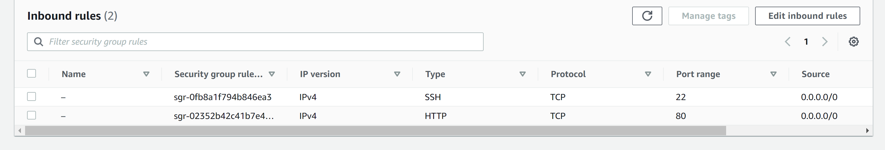
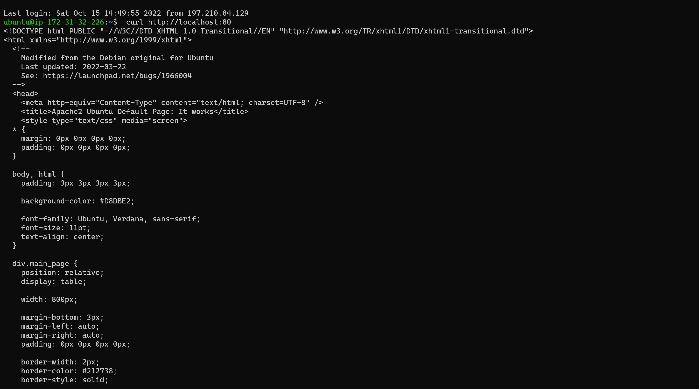
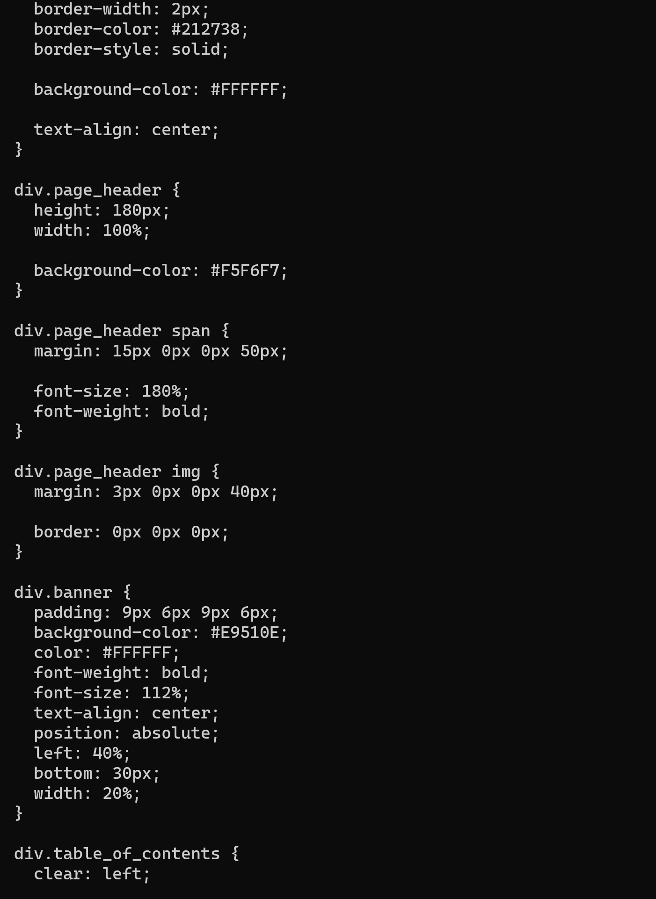
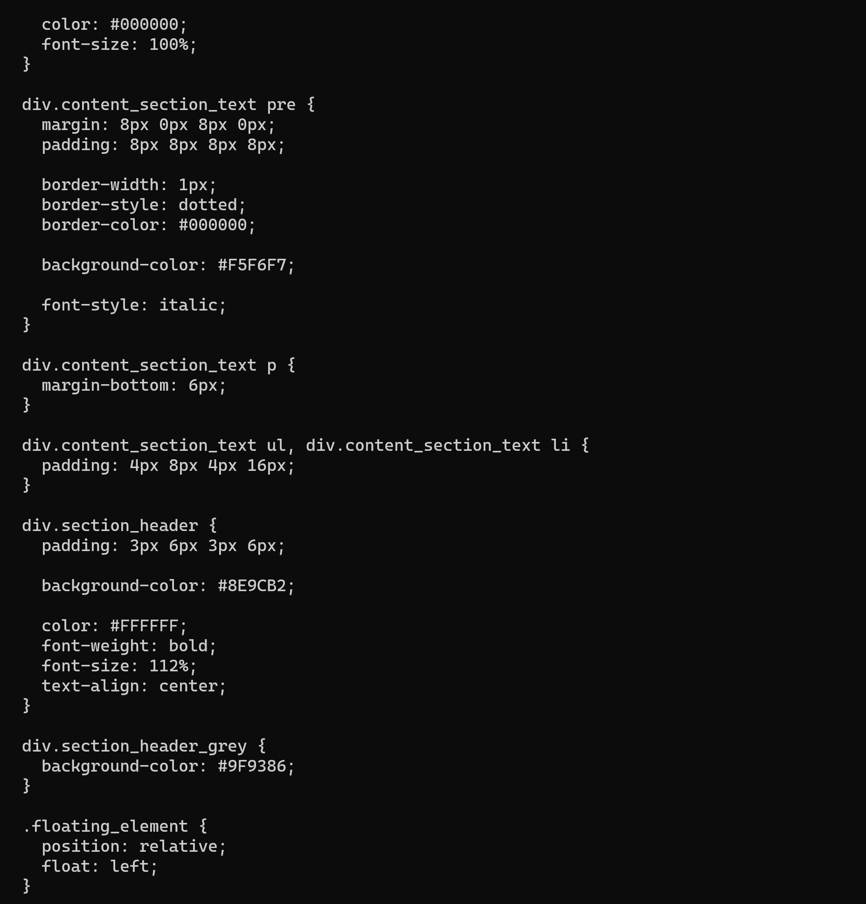
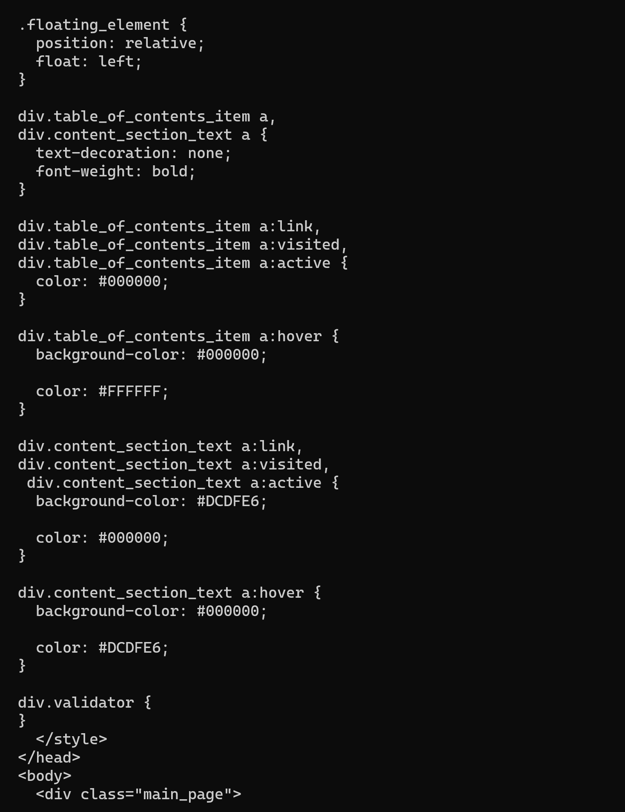
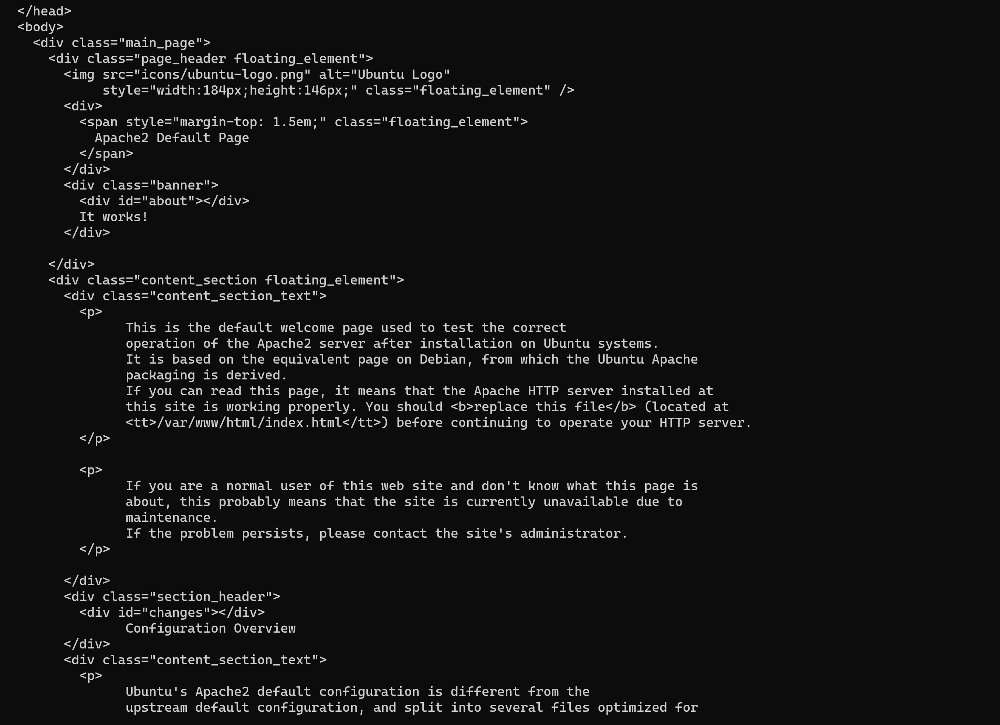
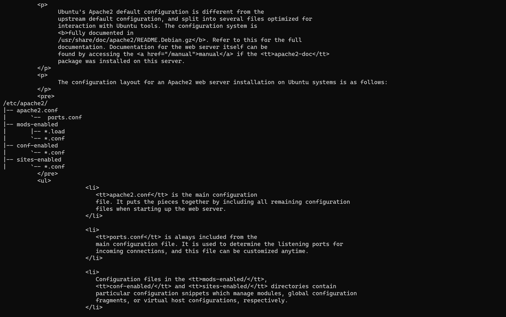
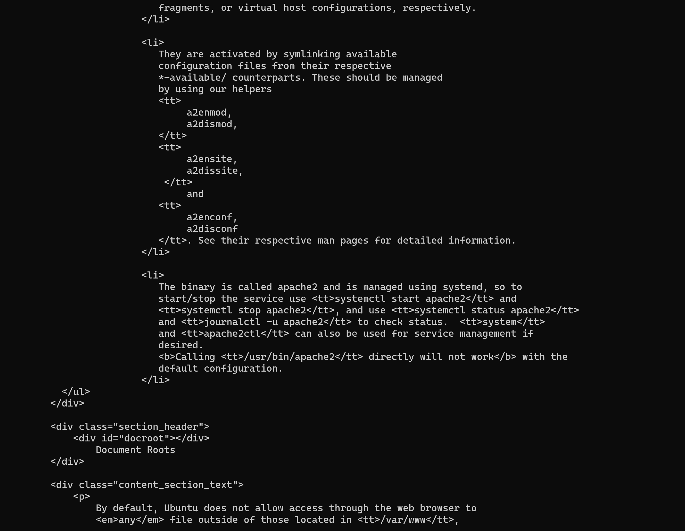
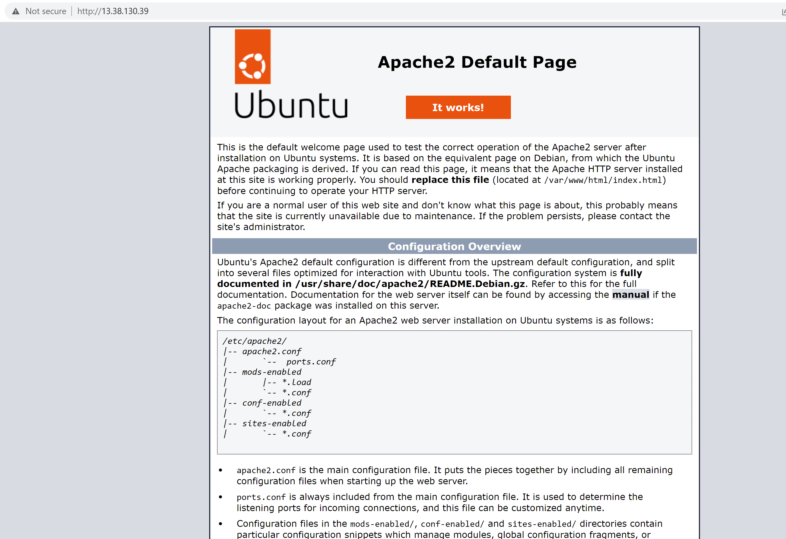
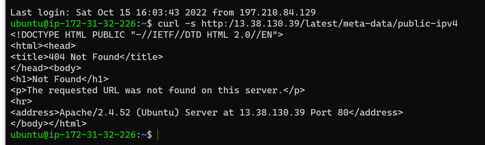

## Documentation for project 1 (LAMP STACK IMPLEMENTATION)

`sudo apt update`

`sudo apt install apache2`

`sudo systemctl status apache2`

Opened inbound connection through port 80

`curl http://localhost:80`

[apache http](http://13.38.130.39)

`curl -s http:/13.38.130.39/latest/meta-data/public-ipv4`

